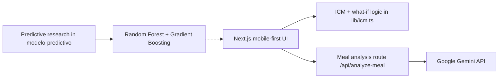

# GEMA · Metabolic Digital Twin

> **Tu salud es una joya.** An interactive MVP for metabolic-risk awareness and personalized what-if guidance.

<p align="center">
  <a href="https://gema-metabolic-twin.vercel.app"></a>
  <a href="./modelo-predictivo"></a>
  
</p>

<p align="center">
  <a href="https://gema-metabolic-twin.vercel.app"></a>
</p>

GEMA is a product and research prototype for a **metabolic digital twin**: it turns daily signals such as glucose, activity, sleep, stress, and nutrition into an interpretable **Índice de Carga Metabólica (ICM)**. The experience is designed for the Peruvian context and makes the model legible through an animated twin, risk explanations, and counterfactual scenarios.

> **Research notice:** The predictive models currently use synthetic data and are not clinically validated. GEMA is an educational prototype, not a diagnostic tool or a substitute for medical care.

## Project snapshot

| Area | Details |
| --- | --- |
| **Live product** | [Open the GEMA MVP](https://gema-metabolic-twin.vercel.app) |
| **Product scope** | Mobile-first metabolic-risk awareness, explainable scoring, and what-if guidance. |
| **Research scope** | Synthetic-data baselines for risk classification and post-meal glucose estimation. |
| **Runtime** | Next.js frontend with an optional server-side Gemini meal-analysis route. |
| **Deployment** | Vercel, connected to the `main` branch of this repository. |

The demo is optimized for a mobile viewport inside a desktop browser. It is intentionally presented as an inspectable MVP: the product flow is complete enough to explore, while clinical integrations and real patient data remain out of scope.

## What the MVP demonstrates

- 💎 A digital twin with three visible states: healthy, neutral, and at-risk.
- 📊 An ICM from 0–100 built from five interpretable sub-indices: glucose, activity, sleep, stress, and nutrition.
- 🍽️ Meal logging with local estimates and an optional Gemini-powered image-analysis route.
- 🔁 A **what-if** simulator that shows how a change such as a post-meal walk can affect the projected outcome.
- 📈 Progress, alerts, recommendations, a five-year projection, and a doctor-report concept.
- 📱 A complete onboarding-to-dashboard flow with camera, wearable, and CGM touchpoints represented as MVP simulations.

## Product gallery

These visuals come from the product prototype and the GEMA model presentation included in the repository.

<p align="center">
  
  
</p>

<p align="center">
  
  
</p>

## Technical overview



### Stack

- **Next.js 14 App Router**, React 18, TypeScript
- **Tailwind CSS**, Framer Motion, Lucide icons
- **Gemini** through a server-side Next.js route, with a local fallback when the API is unavailable
- **scikit-learn**, pandas, joblib for the offline model experiments
- Vercel-ready deployment with no custom server required for the frontend MVP

### Current implementation boundary

| Capability | Status |
| --- | --- |
| ICM calculation and what-if projection | Implemented locally in `lib/icm.ts` |
| Meal image analysis | Implemented through `/api/analyze-meal`; falls back locally without a key or quota |
| Risk classifier and glucose predictor | Reproducible offline experiments in `modelo-predictivo/`; trained with synthetic data |
| Camera and avatar onboarding | Functional browser flow with prototype data and local assets |
| Google login, BLE wearable sync, and CGM | Product-surface simulations for this MVP |

The boundary is intentional: the repository shows the product interaction and the modeling pipeline without implying clinical or production readiness.

## Model snapshot

The research module documents two complementary baselines:

1. **Random Forest classifier** for low, moderate, and high metabolic-risk classes.
2. **Gradient Boosting regressor** for an estimated post-meal glucose peak.

On the current synthetic evaluation set, the documented results are **88.5% accuracy** for the classifier and **6.3 mg/dL MAE / 0.914 R²** for the regressor. These are engineering benchmarks, not evidence of clinical performance. See [`modelo-predictivo/DESCRIPCION_MODELO.txt`](modelo-predictivo/DESCRIPCION_MODELO.txt) for assumptions, inputs, metrics, and references.

## Run locally

```bash
npm ci
copy .env.example .env.local  # PowerShell; use cp on macOS/Linux
npm run dev
```

Open [http://localhost:3000](http://localhost:3000).

For Gemini meal analysis, add this to `.env.local`:

```env
GEMINI_API_KEY=replace-me
```

Without the key, the interface continues with its deterministic local estimate. Never commit `.env.local` or API keys.

## Reproduce the research model

```bash
cd modelo-predictivo
python -m venv .venv
# macOS/Linux: source .venv/bin/activate
# Windows PowerShell: .venv\\Scripts\\Activate.ps1
pip install -r requirements.txt
python entrenar_modelo.py
python predecir.py
```

The notebook [`GEMA_modelo_predictivo.ipynb`](modelo-predictivo/GEMA_modelo_predictivo.ipynb) is also suitable for Google Colab. Generated evaluation plots and the model presentation are kept under `modelo-predictivo/presentacion/`.

## Repository map

```text
.
├── app/                    # Next.js layout, page, and server route
├── components/             # Phone frame, twin, charts, and UI primitives
├── screens/                # Product screens used by the interactive flow
├── lib/                    # Domain types, demo data, and ICM logic
├── public/images/          # Product imagery and twin states
├── modelo-predictivo/      # Synthetic-data experiments and trained baselines
├── docs/                   # System flowchart and generator
└── reporte/                # Research figures and supporting paper assets
```

## References and supporting material

- [`docs/flujograma-gema.svg`](docs/flujograma-gema.svg) — system flow.
- [`modelo-predictivo/`](modelo-predictivo/) — data generator, training scripts, metrics, and presentation graphics.
- [`reporte/`](reporte/) — the GEMA paper source, final PDF, and supporting figures.
- Product narrative: **GEMA — Tu salud es una Joya** (“Your health is a gem”), reflected in the interface and the original product deck.

## Verification and deployment

Pull requests and pushes to `main` run [the repository workflow](.github/workflows/ci.yml) on Node 20. It installs the lockfile, type-checks the TypeScript sources, and builds the production app. The same checks can be reproduced locally:

```bash
npm ci
npx tsc --noEmit
npm run build
```

Vercel deploys this repository with the Next.js preset and the default build settings. No `vercel.json` is required. Configure `GEMINI_API_KEY` only as a server-side Vercel environment variable when enabling the optional image-analysis route; the public preview does not require a key for its deterministic fallback.

## License

No license file is currently included. Add a license before accepting external contributions or redistributing the code.
